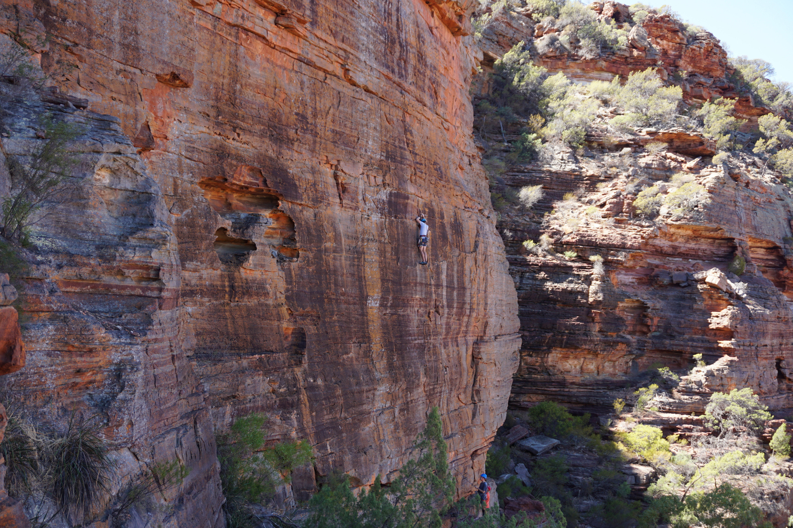
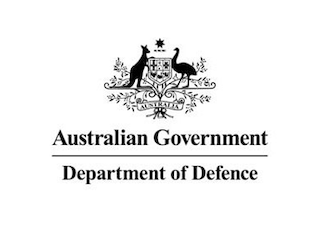
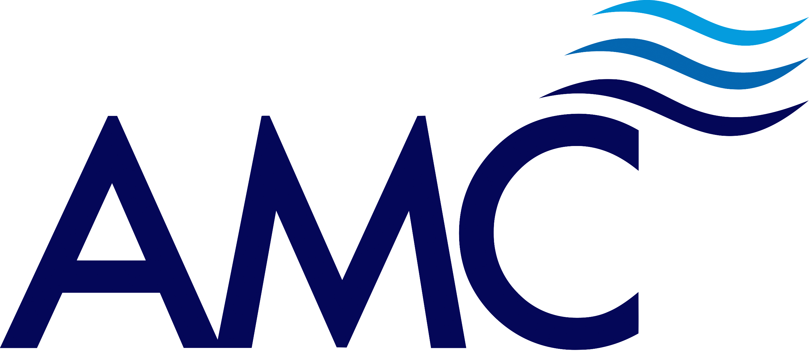

# About me

<h3>Dylan Van Drunen.</h3>
<h6>Naval Architect</h6>
<h6><a href="mailto:dylanvandrunen@gmail.com" >dylanvandrunen@gmail.com</a></h6>

Naval Architect with four years of experience as a Project Engineer specialising in analysis.   I am currently working for Nexans Norway gaining Project Engineering and analysis experience in subsea power cables.   I enjoy applying my programming knowledge to solve engineering problems by automating processes and providing data-driven insights.

# Projects

# Work History
<h2><a href="https://www.nexans.com/en/">Nexans</a></h2>

<h4>Project Engineer | 2022 to Current</h4>

Planning and executing subsea cable installation and analysis.

<h5>Chevron</h5>
<li>Jansz IO subsea compression cable</li>
<li>BUP Umbilical</li>
<h5>Internal Software Developemnt</h5>
<li>Converting Excel tools into web apps</li>
<li>Automating regular lay analysis</li>

<h2><a href="https://www.fugro.com/">Fugro</a></h2>

<h4>Project Engineer | 2021 to 2022</h4>

Planning and executing offshore maintenance campaigns and installation analysis.

<h5>BHP - IMR</h5>
<li>SCM changeout</li>
<li>UTA recovery to deck for repairs</li>
<h5>Jadestone - Rig Pre-Intervention</h5>
<li>Anode Skid installation</li>
<li>Tree valve soaking and functioning</li>
<li>Umbilical Crossover installation</li>
<h5>Unmanned Surface Vessel <a href='https://www.fugro.com/media-centre/news/fulldetails/2021/07/30/fugro-completes-first-usv-remote-inspection-for-australia-s-woodside'>Fugro Maali</a></h5>
Project engineering and design/analysis for Fugro's unmanned survey vessel. 

<h2><a href="https://www.advisian.com/en/what-we-do/services/intecsea/innovation">Intecsea</a></h2>

<h4>Floating Systems Engineer | 2019 to 2021 </h4>

Performed hydrodynamic analysis on a variety of floating and subsea structures.

Used Python on a daily basis to facilitate the processing and visualization of the large amount of data from response based analysis. Created pre- and post-processing functions/classes for a variety of engineering software, then integrated the functions into a custom Python module to automate and streamline analysis.

<h2><a href="https://www.austal.com">Austal Ships</a></h2>

<h4>Naval Architect | 2019</h4>

Six month Defence placement at Austal ships as part of the design team for JRK passenger trimaran. Performed structural design and analysis on primary and secondary hull structures to DNV-GL and HSC codes using STRAND7 for FEA. Coordinated with draftsmen in Vietnam to draft the designs.

 Developed and supervised lift plans for unit lifts with shipyard team leads.  Participated in sea trials and inclining experiment for a Pacific Patrol Boat.

<h2><a href="https://www.navy.gov.au/about/our-people/civilian-engineer-development-program/introduction">Department of Defence</a></h2>

<h4>Graduate Naval Architect | 2018 - 2019</h4>

 Performed stability and hydrodynamic analysis on Navy vessels assessing current vessels and tenders to naval standards. This included intact and damage stability, seakeeping using time domain software and resistance calculations using empirical methods and CFD.

Defence client representative for inclining experiments on Navy landing craft, ANZAC class frigate and patrol boats.

# Education 

<h2><a href="https://www.amc.edu.au">Australian Maritime College</a></h2>

<h3>Bachelor of Maritime Engineering (Naval Architecture) (Honours)</h3>
<h3>2014 to 2017</h3>
