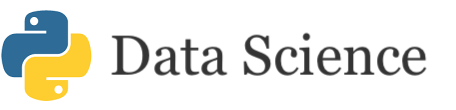
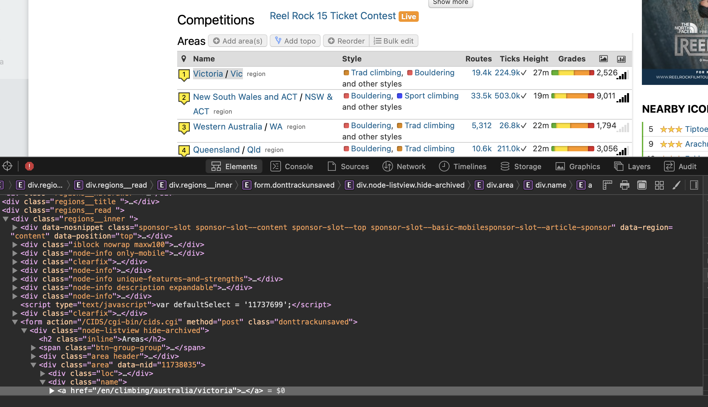

# Coding Projects

## Adventure Dashboard Web App

#### Overview

Adventure Outside is a website that collates location of all the outdoor activities in Australia. This allows for easy adventure planning packing the most into a weekend ensuring you don't miss a spot. 

#### Backend

The website is a multipage Dash App. Dash was created by Plotly to easily create interactive graphing apps in Python without having to write any Java Script. Heroku makes it easy to deploy the app once the dependencies are specified.

#### Data 

The locations, brief details and url link to comprehensive information where web-scraped off the main activity websites. The web-scraping was done in Python using a combination of Requests, Beautiful Soup and Selenium. GPS coordinates were either web-scraped or using Googles Geolocation API.

[Go to the website...](http://www.adventureoutside.com.au){:target="_blank"}

## Learning Python for Data Science

Here is a collection of Jupyter Notebooks I have compiled/created for learning Python for Data Science. I taught this to the graduates at Worley in person. The notebooks are hosted on Binder making them fully interactive without the hassle of installing Python and setting up an environment.

{:target="_blank"}

## Optical Character Recognition

Optical Character Recognition (ORC) can be used when automating a process that requires reading text. This example uses Tesseract, an Open Sourced program by Google, to perform OCR. Image processing is done using OpenCV. Google provides APIs such as Google Image to perform OCR. This has the advantage of being scalable but has a cost per request.

[Show me the notebook...](2020-10-02-or.html)

[Download the notebook...](2020-10-02-or.ipynb)
## Web Scraping with Python

Web scraping is an essential tool for any data analysis project. The Crag is a platform for logging and detailing rock climbing areas and routes. The Crag's well structured data makes it a great candidate for web scraping.

[Show me the notebook...](2020-02-11-thecrag.html)

[Download the notebook...](notebooks/TheCragAPI.ipynb)

## AR Business Cards

gif of business card

Business cards spiced up with some AR. The AR model is hosted on this website (Github) which is linked via the QR code. The AR animation has image recognition built into it so it tracks the business card.

[Link to the model...](2021-02-05-mm-bc.html)