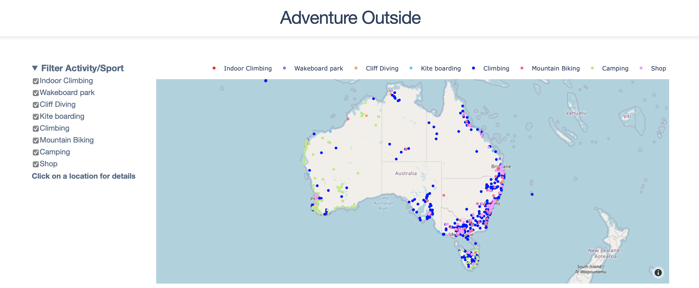
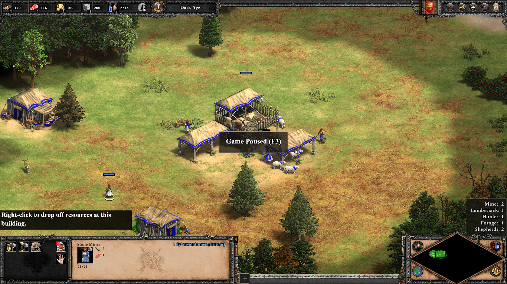

# Coding Projects

## Adventure Dashboard Web App

#### Overview

Adventure Outside is a website that collates location of all the outdoor activities in Australia. This allows for easy adventure planning packing the most into a weekend ensuring you don't miss a spot. 

#### Backend

The website is a multipage Dash App. Dash was created by Plotly to easily create interactive graphing apps in Python without having to write any Java Script. Heroku makes it easy to deploy the app once the dependencies are specified.

#### Data 

The locations, brief details and url link to comprehensive information where web-scraped off the main activity websites. The web-scraping was done in Python using a combination of Requests, Beautiful Soup and Selenium. GPS coordinates were either web-scraped or using Googles Geolocation API.

[Go to the website...](http://www.adventureoutside.com.au)
## Optical Character Recognition

Optical Character Recognition (ORC) can be used when automating a process that requires reading text. This example uses Tesseract, an Open Sourced program by Google, to perform OCR. Image processing is done using OpenCV. Google provides APIs such as Google Image to perform OCR. This has the advantage of being scalable but has a cost per request.

[Show me the code...](2020-10-02-or.html)